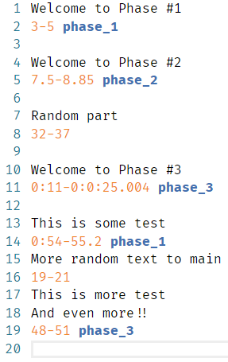

# Ranges Files Language Support
This repository is a helper _vs code_ extension for [Ranger](https://github.com/lunakoly/Ranger). It adds support for _ranges-files_ syntax.

# Installation
Clone this repository into `~/.vscode/extensions/` folder.